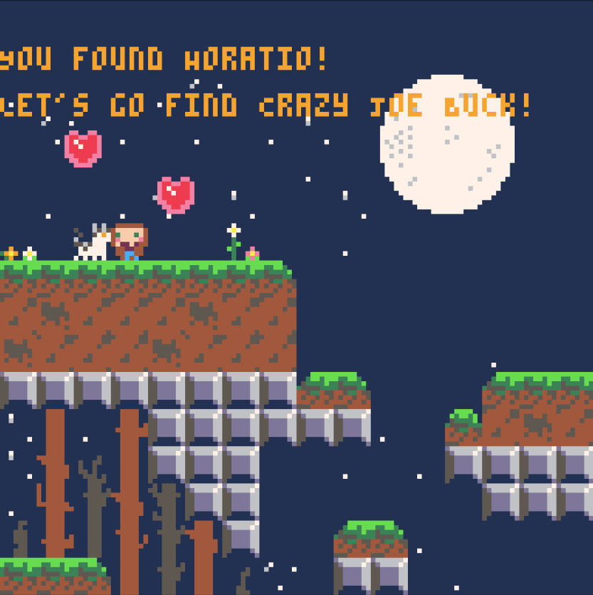

# KMG
KMG is a Celeste-style platformer made with [PICO-8](https://www.lexaloffle.com/pico-8.php).
You can try it out on [itch.io](https://chunkilu.itch.io/kmg)!

My wife (Ashley) and I developed the game as a Christmas gift for my sister and brother
in law (Mollie and Gus). Ashley created the sprites and maps and I contributed the code, music
and sfx. The gist of the game is that my sister's house cats have escaped and need
finding, but will only show themselves if lured out with snacks.

I've always been inspired by Hackernews posts about the value of finishing
a game - though the concept of a "finished" game is subjective, picking a small
and well-defined enough scope, sticking to a deadline and actually releasing are indeed helpful motivators and quite satisfying.

Publishing our [first PICO-8 game on
itch.io](https://chunkilu.itch.io/frite-lite) gave us a sufficient confidence
boost to try and tackle a more complex game and Christmas provided a natural
deadline. While this codebase admittedly showcases a number of programming
antipatterns I normally pride myself on avoiding (magic numbers! duplication! super-long
functions! no tests! one file?!), this was by far the most rewarding personal project I've ever
worked on. Collaborating with Ashley was a delight, the quality of her sprites and maps surpassed my wildest expectaions and we had a ton of fun bringing the concepts to life.
As an extra Christmas touch, we bought a Powkiddy RGB-30 (cool!) and installed the
game on an SD card so that the game could be played on a physical console.
While I would point to other personal projects for examples of perhaps more
elegant software engineering practices, KMG will always have a special place in
my heart as it brought the family together.

